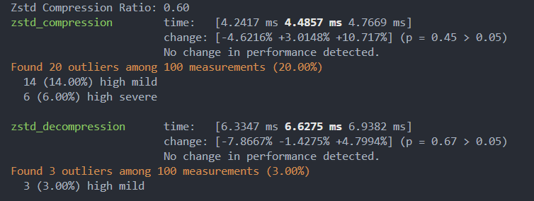
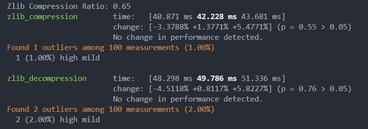
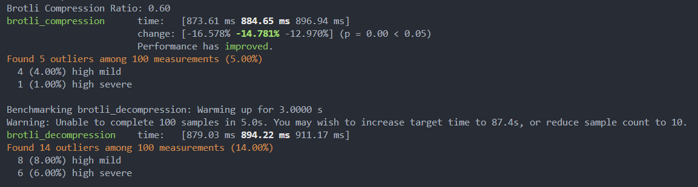
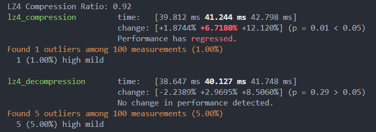

Log out design here.

## 10/7/24
Files created: utility.rs

```
Reason: utility was created to store helper functions and unclutter the main.rs file
```

Catching function errors with "?"
```

In Rust, the ? operator is used for error handling and propagation. When placed after a function that returns a Result type, it does the following:

Checks for Errors: The ? operator checks if the Result is Ok (indicating success) or Err (indicating failure).

Returns on Error: If the Result is Err, the ? operator will automatically return that error from the enclosing function. This means you don’t have to write explicit error handling code for that specific operation.

Unwraps on Success: If the Result is Ok, it extracts the value inside and continues executing the code
```

## Getting Started
1. Rit init and remove (what ever the git command is to remove the repo)
    1. Setup a temaplate style input where commands we can easily added and there corresponding function call to handle the process.
2. Benchmarks for compression algos
    1. lzma
    2. zlib
    3. And any others
    4. Test for speed and size on a range of file types.
  

## 10/8/24
Worked on the benchmarks for the compression algorithms.

### Algorithms tested
- brotli = "7.0.0"
- flate2 = "1.0.34"
- lz4 = "1.28.0"
- zstd = "0.13.2"

### Results:
Overall Zstd beat all the other libs out of the water, with a 40% compression at 4.5ms and decompresion at 6.5ms.

#### Zstd


#### Flate2


#### Brotli


#### Lz4

